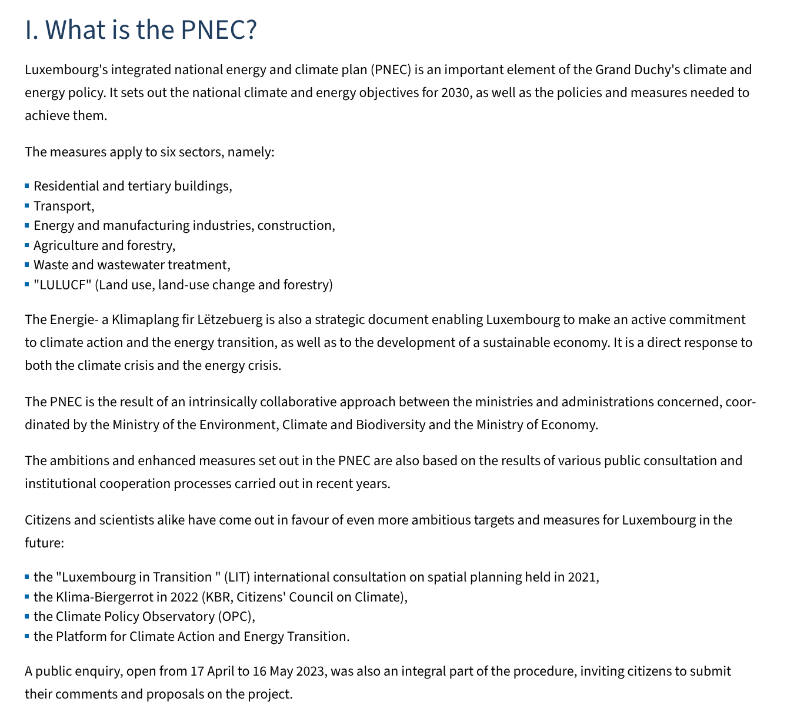
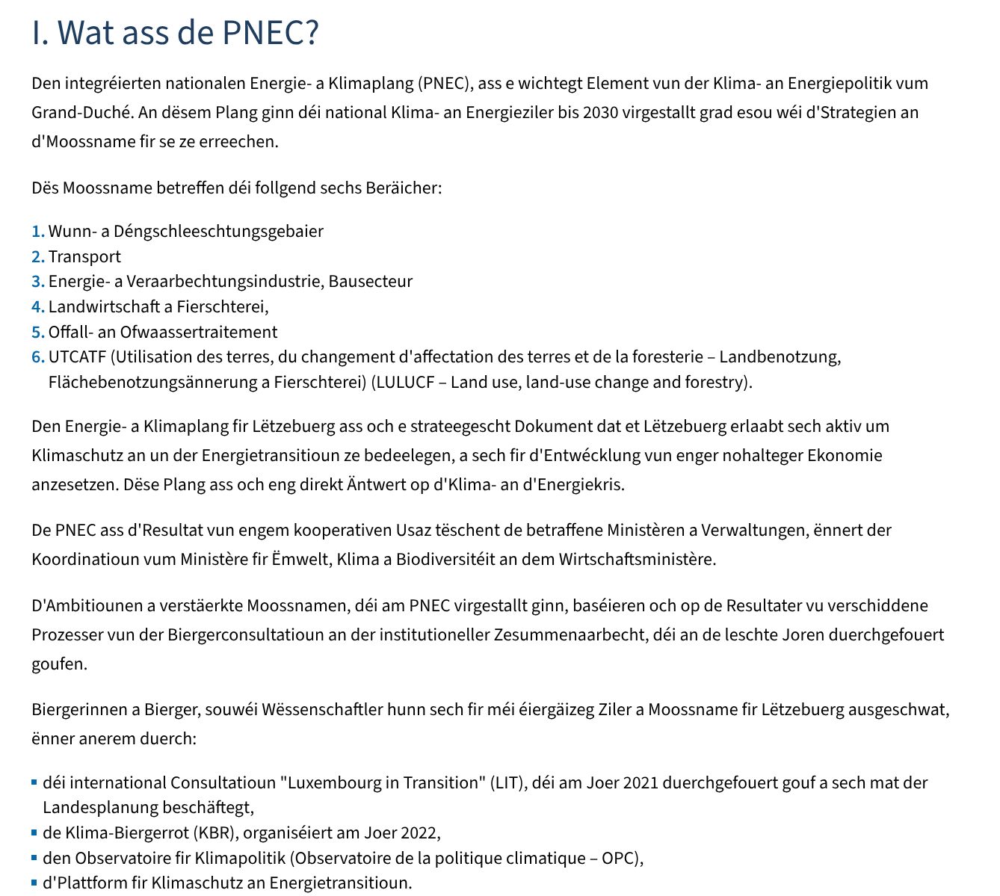
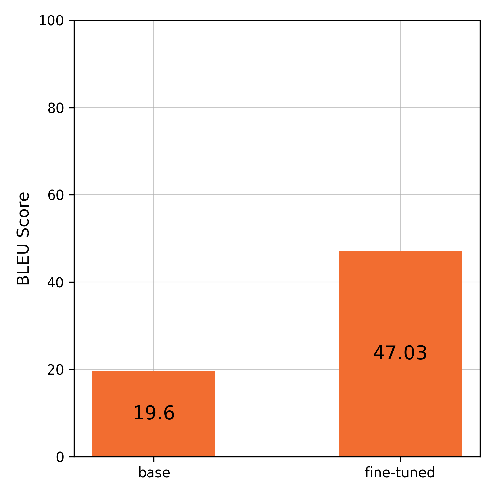

# About
This repository contains the code for our CS 5100 Foundations of AI project at Northeastern University (Boston). We built an NLP-powered web app that translates between English and a low-resource language (Luxembourgish) using a fine-tuned No Language Left Behind (NLLB) model from Hugging Face. It supports direct text input, image uploads (using Tesseract), and audio files (using OpenAI Whisper), all within an easy-to-use GUI built with Gradio.


## Group members:
1. Aayam Raj Shakya
2. Brendan Fullerton
3. Abhijeet Khandagale 


> [!IMPORTANT]
> 1. All three of us either use macOS or Linux, hence we don't support Windows instructions. But the installation process will be similar.
> 2. The model is STRICTLY optimized for CUDA; running `main.py` on a CPU (or even MPS) device might cause some performance issues.
> 3. We recommend using `uv` instead of `pip`, though either will work for this project.
> 4. You'll need to log in to Hugging Face via the CLI to get a higher download rate limit and to access the FLORES dataset:
> - [HF CLI installation guide](https://huggingface.co/docs/huggingface_hub/guides/cli#standalone-installer-recommended)
> - [Setting up](https://huggingface.co/docs/huggingface_hub/guides/cli#hf-auth-login)
> 5. Install the required system dependencies **Tesseract OCR** and **FFmpeg**:
>    ```bash 
>    sudo dnf install tesseract ffmpeg      # Fedora
>    brew install tesseract ffmpeg          # macOS
>    sudo apt install tesseract-ocr ffmpeg  # Ubuntu/Debian    
>    ```


## Repository Structure

```
transl-AI-tor/
├── pyproject.toml            # project metadata and dependencies (used by uv)
├── .python-version           # python version (used by uv)
├── uv.lock                   # records the exact versions of every project dependency (used by uv)
├── config.py                 # contains major configurable hyperparameters
├── main.py                   # main script that contains code for fine-tuning, inference, and evaluation
├── app.py                    # Gradio web app
├── README.md                 # this file :)
├── helper-scripts/
│   ├── barplot.py                    # pyplot script used to make BLEU score bar graph
│   ├── bleu_bar_graph.png            # resultant BLEU score bar graph
│   └── crawl_site_recursively.py     # Crawl4AI web crawler for scraping websites for additional training data
└── results/                  # created during training to store results
    └── best_model/           # saved best fine-tuned model weight
```


## Getting started

```bash
uv sync                             # auto-installs dependencies and syncs the environment
uv run python main.py finetune      # fine-tune the model
uv run python main.py eval          # evaluate the model
uv run python main.py finetune eval # fine-tune then evaluate
```


### To launch the web app, run:

```bash
uv run python app.py
```
Then, access the interface at [http://127.0.0.1:7860/](http://127.0.0.1:7860/)

> [!NOTE]
> 1. The first run will take longer because the script needs to download and load the required OCR and speech-to-text models.
> 2. We've enabled `flagging` in audio and image translation modes to save any incorrect translations, as these are the most prone to error. The logs along with the inputs (image/audio) will be saved to `.gradio/flagged/`.


### Special mention
`helper-scripts/crawl_site_recursively.py`:
The main purpose of this website crawler was to scrape data from Luxembourgish websites and their corresponding English translations to increase the training data in case more was needed.

| https://gouvernement.lu/en/dossiers/2023/2023-pnec.html | https://gouvernement.lu/lb/dossiers/2023/2023-pnec.html |
| :-----: | :-----: |
|  |  |

We found several other websites (mainly governmental) that offer both English and Luxembourgish versions. Scraping these sites would provide thousands of rows of additional training data.


## Results

